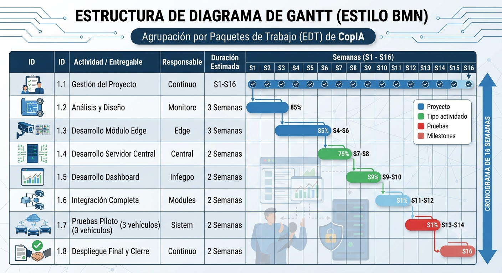

# Entregable 3. Plan de Gestión del Proyecto (PMBOK / Agile)

- **Evalúa:** CE013 – Gestión de Proyectos de TI
- **Competencias:** CE0131 – CE0136
- **Proyecto:** CopIA – Driver Monitoring System (DMS) – Huaynaroque
- **Equipo:** Christian Wilbert Salas Yupanqui | Cristhian Eddy Llanque Tipo | Frank Diego Choquehuanca Huayhua
- **Docentes:** Abel Huanca
- **Universidad:** Universidad Peruana Unión – Filial Juliaca | 2026

---

## 3.1 Acta de Constitución
**Sponsor:**
Alfredo Jesus Quispe Ccapa – Gerente General de Huaynaroque

**Objetivos:**

- Implementar el sistema CopIA en el 100% de la flota de Huaynaroque.
- Reducir los incidentes por fatiga del conductor en un 40% en el primer año.
- Garantizar monitoreo en tiempo real de toda la flota mediante dashboard centralizado.
- Cumplir con los requisitos de seguridad vial establecidos por el MTC y SUTRAN.

**Alcance preliminar:**

- Desarrollo e implementación del módulo edge en Raspberry Pi.
- Despliegue de la API central FastAPI en servidor AWS.
- Integración con Firebase Realtime Database.
- Dashboard web React para administradores.

**Restricciones y supuestos:**
*Restricciones:* Presupuesto fijo, plazo de implementación de 5 meses, uso de AWS con límite de costo.
*Supuestos:* Conectividad 4G disponible en rutas principales, capacitación previa al despliegue, disponibilidad de Firebase.

## 3.2 Gestión del Alcance
**EDT / WBS:**

| ID | Entregable / Paquete de Trabajo |
|---|---|
| 1.0 | PROYECTO COPIA – DMS Huaynaroque |
| 1.1 | Gestión del Proyecto |
| 1.2 | Análisis y Diseño del Sistema |
| 1.3 | Desarrollo del Módulo Edge (Raspberry Pi) |
| 1.4 | Desarrollo del Servidor Central (FastAPI) |
| 1.5 | Desarrollo del Frontend (Dashboard) |
| 1.6 | Integración y Pruebas |
| 1.7 | Despliegue y Capacitación |
| 1.8 | Documentación y Entregables |

**Diccionario de entregables:**
Cada paquete cuenta con criterios de aceptación como la funcionalidad de la Raspberry Pi, latencia de API, precisión de IA, etc.

## 3.3 Gestión del Cronograma
**Lista de actividades:**
Se detalla en la herramienta de gestión ágil (Jira/Trello), dividida en sprints de 2 semanas.

**Diagrama de Gantt:**

**Hitos principales:**

| Hito | Descripción | Semana |
|---|---|---|
| H1 | Aprobación del Project Charter | S1 |
| H2 | Diseño de arquitectura completado | S3 |
| H3 | Módulo edge funcional (detección local) | S6 |
| H4 | API central desplegada en AWS | S8 |
| H5 | Dashboard con mapa y telemetría en vivo | S10 |
| H6 | Integración completa edge-cloud-frontend | S12 |
| H7 | Pruebas de aceptación con 3 vehículos piloto | S14 |
| H8 | Despliegue completo en flota | S16 |

## 3.4 Gestión de Costos
**Presupuesto detallado:**

| Ítem | Costo Estimado (S/.) |
|---|---|
| Hardware (Raspberry Pi, cámaras, GPS) | 295,500 |
| Servidor AWS EC2 (6 meses) | 2,400 |
| Conectividad 4G (6 meses) | 27,000 |
| Horas de desarrollo e implementación | 15,000 |
| Contingencia (10%) | 34,990 |
| **TOTAL** | **384,890** |

**Línea base de costos:**
Se establece en S/. 384,890 con monitoreo mensual.

## 3.5 Gestión de Riesgos
**Identificación:**
Conflictos de librerías, latencia de streaming MJPEG, scope creep, pérdida de telemetría.

**Análisis cualitativo:**
Evaluación de impacto (1-5) y probabilidad (1-5) para cada riesgo.

**Plan de respuesta:**

| Riesgo | Respuesta |
|---|---|
| Incompatibilidad de librerías | Fijar versiones en requirements.txt |
| Latencia en streaming | Optimizar resolución y buffer |
| Cambios de alcance | Comité de cambios formal |
| Pérdida de conectividad | Cola local en Raspberry Pi |

## 3.6 Gestión Ágil (si aplica)
**Product backlog:**

- Historia de usuario para captura de cámara.
- Historia para detección EAR/MAR.
- Historia para API de telemetría.
- Historia para Dashboard y mapa.

**Sprint planning:**
Sprints de 2 semanas con reuniones diarias de standup y retrospectivas.

**Incrementos:**
Entregas funcionales cada 2 semanas: primero el modelo local, luego la API, finalmente la integración web.
