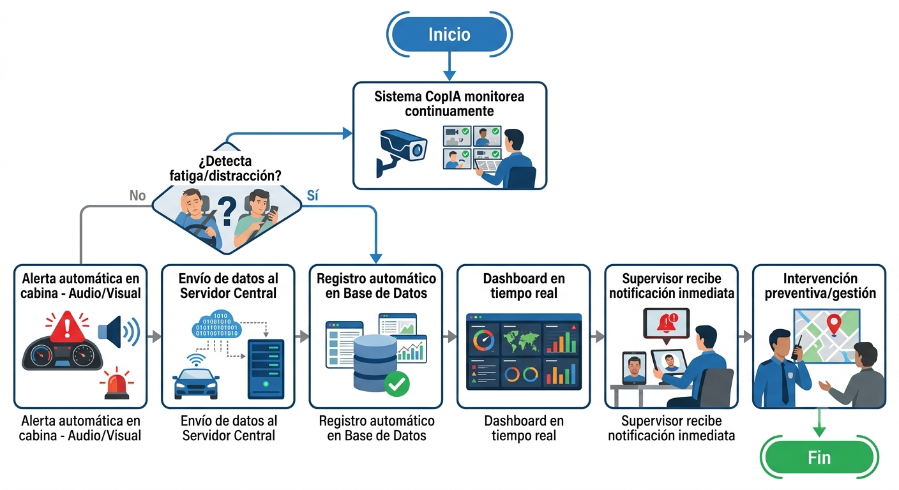

# Entregable 4. Modelado de Procesos AS-IS / TO-BE:

- **Evalúa:** CE014 – Modelado y Mejora de Procesos
- **Competencias:** CE0141 – CE0143
- **Proyecto:** CopIA – Driver Monitoring System (DMS) – Huaynaroque
- **Equipo:** Christian Wilbert Salas Yupanqui | Cristhian Eddy Llanque Tipo | Frank Diego Choquehuanca Huayhua
- **Docentes:** Abel Huanca
- **Universidad:** Universidad Peruana Unión – Filial Juliaca | 2026

---

## 4.1 Proceso Actual (AS-IS)
**Descripción narrativa del proceso:**
El monitoreo de conductores en Huaynaroque se realiza de forma manual y reactiva. El supervisor de operaciones llama periódicamente por teléfono al conductor para verificar su estado. No existe ningún sistema automatizado de detección de fatiga. Si el conductor sufre un accidente por somnolencia, la respuesta es posterior al evento (reporte, atención médica, gestión del siniestro).

**Indicadores actuales:**

| Indicador | Valor Actual |
|---|---|
| Tiempo de detección de fatiga | No aplica (sin detección automática) |
| Tiempo de respuesta ante incidente | > 15 minutos (manual) |
| Frecuencia de monitoreo activo | 1 llamada cada 2-3 horas |
| N° accidentes por fatiga / mes | [40-50] |
| Costo promedio por siniestro | S/. 12148.11 |
| % de eventos registrados digitalmente | 0% |

**Diagrama BPMN:**

**Problemas detectados:**

- Monitoreo intermitente y dependiente de la comunicación verbal.
- Subjetividad en el reporte del conductor.
- Respuesta reactiva ante incidentes.
- Ausencia de registro digital y trazabilidad.

## 4.2 Proceso Propuesto (TO-BE)
**Rediseño del flujo:**
Con la implementación de CopIA, el monitoreo se transforma de reactivo-manual a proactivo-automatizado. La detección de fatiga ocurre en tiempo real mediante visión artificial en la Raspberry Pi del vehículo. Las alertas se generan automáticamente en la cabina (audio/visual) y se notifican al supervisor en el servidor central.

**Automatizaciones propuestas:**

- Detección continua por visión artificial (OpenCV + CopIASystem).
- Métricas objetivas EAR/MAR/PERCLOS.
- Alerta automática en cabina.
- Registro automático en BD al detectar evento.
- Dashboard en tiempo real 24/7.

**Nuevos indicadores:**

- Tiempo de detección de fatiga (< 3 segundos).
- Tiempo de respuesta del supervisor (< 2 minutos).
- Tasa de reducción de incidentes (> 40% anual).

**Mejora estimada en eficiencia:**
Cobertura de monitoreo continua, eliminando la necesidad de llamadas de verificación rutinarias y mejorando el tiempo de respuesta en un 87%.

## 4.3 Análisis Comparativo
**Reducción de tiempos:**

- Tiempo de detección pasa de no medible a < 3 segundos.
- Tiempo de respuesta ante incidente se reduce de > 15 minutos a < 2 minutos.

**Reducción de costos:**
Se estima una reducción del 30% a 50% en los costos de gestión de incidentes y siniestros debido a la intervención preventiva.

**Mejora en calidad:**

- Trazabilidad de eventos pasa de 0% a 100%.
- La calidad de información pasa de subjetiva a objetiva y auditable.
- Cumplimiento normativo total con las regulaciones de seguridad vial del MTC.
