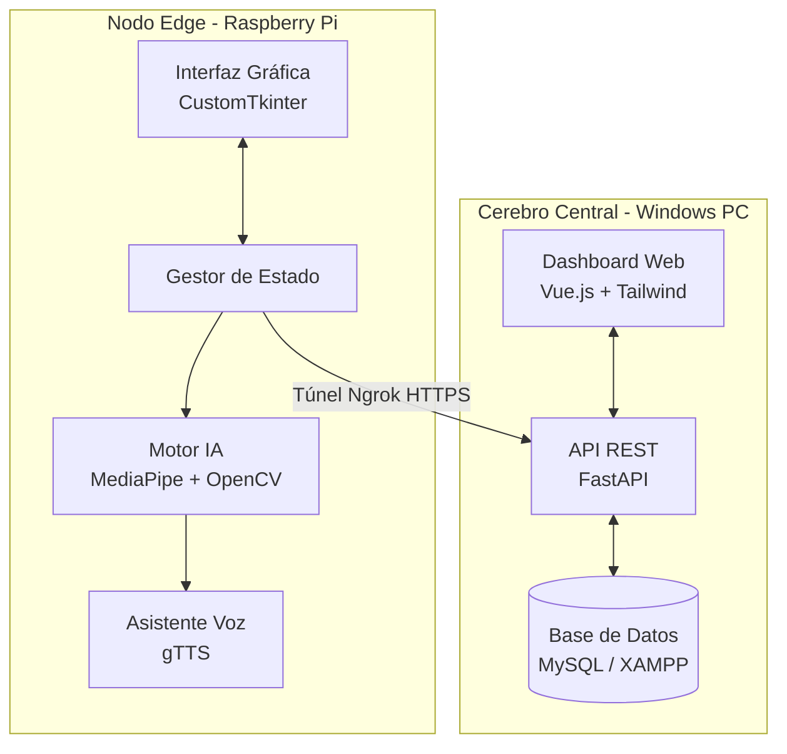
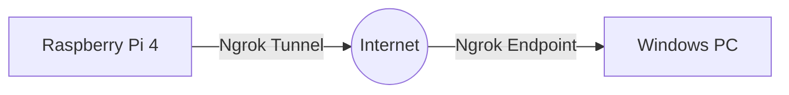
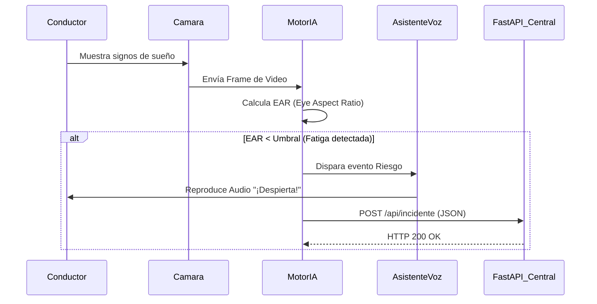
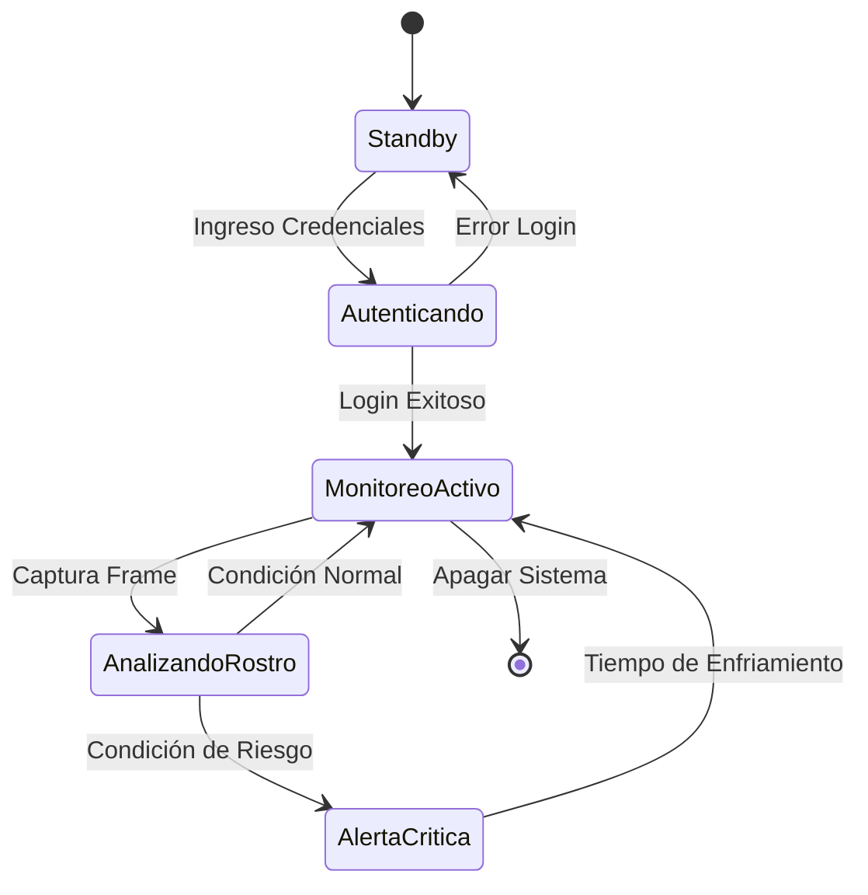

# Entregable 1: Requerimientos y Diseño del Sistema

## Portada
- **Título del sistema:** CopAI - Asistente de Conducción AI (Edge & Central Server)
- **Nombre del estudiante:** Cristhian Edy Llanque Tipo - Christian Wilbert Salas Yupanqui - Frank Diego Choquehuanca
- **Semestre:** X
- **Fecha:** Julio 2026

---

## Resumen Ejecutivo
CopAI es una solución integral de asistencia a la conducción diseñada para prevenir accidentes de tránsito causados por fatiga o distracción al volante. El sistema se compone de dos módulos principales: un **Nodo Edge (Raspberry Pi)** instalado en el vehículo que procesa video en tiempo real mediante Inteligencia Artificial (MediaPipe y OpenCV) para detectar somnolencia o falta de atención, y un **Cerebro Central (Servidor Windows)** que centraliza los datos, emite reportes y permite el monitoreo remoto por parte de la empresa de transportes a través de una aplicación web (Vue.js + FastAPI + MySQL). La comunicación entre ambos nodos se realiza de forma segura mediante túneles inversos (Ngrok).

El alcance del proyecto cubre desde la detección local en tiempo real hasta la persistencia y visualización de las métricas de conducción, ofreciendo alertas sonoras inmediatas al conductor y reportes estadísticos al administrador.

---

## Sección 1: Especificación de Requerimientos

### 1.1 Requerimientos Funcionales (RF)

| ID | Descripción del Requerimiento Funcional | Módulo Asociado |
|:---|:---|:---|
| **RF01** | El sistema Edge debe capturar video en tiempo real utilizando una cámara conectada. | Edge (Cámara) |
| **RF02** | El sistema Edge debe analizar los rostros usando IA para determinar el nivel de fatiga o distracción. | Edge (MediaPipe) |
| **RF03** | El sistema Edge debe emitir alertas sonoras inmediatamente al detectar un nivel de riesgo. | Edge (Audio) |
| **RF04** | El sistema Edge debe requerir inicio de sesión del conductor antes de iniciar el monitoreo. | Edge (GUI) |
| **RF05** | El sistema Edge debe transmitir eventos de riesgo al servidor central a través de una API REST. | Backend |
| **RF06** | El Servidor Central debe almacenar eventos de riesgo y sesiones en una base de datos relacional. | Base de Datos |
| **RF07** | El Servidor Central debe exponer una interfaz web para visualizar el histórico de incidentes. | Frontend Web |
| **RF08** | El Servidor Central debe permitir el registro y gestión (CRUD) de conductores. | Frontend Web |

### 1.2 Requerimientos No Funcionales (RNF)

| ID | Criterio | Descripción del Requerimiento No Funcional |
|:---|:---|:---|
| **RNF01** | Rendimiento | El análisis de video en el Edge debe ejecutarse a un mínimo de 15 FPS en hardware de bajo costo. |
| **RNF02** | Conectividad | El sistema debe encolar eventos localmente si pierde conexión con el servidor (Tolerancia a fallos). |
| **RNF03** | Seguridad | La comunicación entre nodos debe estar encriptada vía túneles inversos HTTPS (Ngrok). |
| **RNF04** | Usabilidad | La interfaz en cabina debe ser táctil, de alto contraste (Dark Mode) y botones grandes. |
| **RNF05** | Despliegue | El servidor central y el nodo Edge deben poder inicializarse mediante scripts automatizados. |

### 1.3 Reglas de Negocio

| ID | Regla |
|:---|:---|
| **RN01** | Un conductor no puede iniciar un viaje ni habilitar la cámara sin antes autenticarse en el sistema. |
| **RN02** | Se considera "Riesgo de Fatiga" cuando los ojos permanecen cerrados por más de 1.5 segundos consecutivos. |

### 1.4 Restricciones del Sistema
- El nodo Edge está limitado al hardware de una Raspberry Pi y a su capacidad de procesamiento térmico (CPU).
- El software Edge se desarrolla en Python 3.11, utilizando entornos virtuales o Conda para garantizar compatibilidad de librerías.

### 1.5 Historias de Usuario
- **HU01:** Como *Conductor*, quiero *iniciar sesión en la pantalla táctil de mi vehículo* para *comenzar el monitoreo de mi viaje.*
- **HU02:** Como *Conductor*, quiero *recibir una alerta de voz inmediata* cuando *muestre signos de sueño*, para *evitar un accidente.*
- **HU03:** Como *Administrador de Flota*, quiero *ver un dashboard web con los incidentes de mis conductores* para *tomar decisiones preventivas.*

### 1.6 Criterios de Aceptación
- Para HU02: La alerta debe sonar en menos de 2 segundos de detectado el evento.
- Para HU03: El panel web debe cargar los datos desde MySQL usando endpoints de FastAPI con código HTTP 200.

---

## Sección 2: Prototipo Navegable

*Nota: Reemplazar los textos entre corchetes con las imágenes correspondientes ubicadas en la carpeta `imagenesllanque`.*

### 2.1 Flujo de Navegación
1. **Inicio:** Pantalla de Login en Edge -> Validación -> Dashboard de Conducción.
2. **Web:** Pantalla de Login Web -> Dashboard Central -> Gestión de Conductores.

### 2.2 Pantallas Principales
- **Pantalla Login Edge:** 
  
  **Descripción Formal:** Interfaz de acceso seguro desarrollada con la librería CustomTkinter en modo oscuro (Dark Theme) para reducir la fatiga visual nocturna del conductor. Incluye controles de formulario (ID de Operador y Contraseña) optimizados para pantallas táctiles vehiculares. El sistema valida las credenciales contra la base de datos central antes de conceder acceso al monitoreo.

- **Pantalla de Monitoreo Edge:**
  
  **Descripción Formal:** Panel principal de conducción ejecutado en el Nodo Edge. La sección principal renderiza el stream de video en tiempo real de la cámara, superponiendo la malla facial (Facial Landmarks) generada por MediaPipe. El sistema extrae métricas biométricas como el Eye Aspect Ratio (EAR) para detectar somnolencia. Incluye indicadores visuales de estado y controles táctiles para finalizar la sesión de monitoreo.

- **Dashboard Web (Cerebro Central):**
  
  **Descripción Formal:** Aplicación web de administración desarrollada con Vue.js y Tailwind CSS. Funciona como el panel de control para la empresa de transportes. Permite la visualización de métricas generales, listado de conductores registrados y un registro histórico detallado de los incidentes de fatiga o distracción reportados por todos los vehículos en tiempo real, garantizando una toma de decisiones preventiva.

### 2.3 Evidencia de Validación
*(Adjuntar aquí el resumen de la prueba con usuarios simulados o feedback de los profesores)*

---

## Sección 3: Diseño Arquitectónico

### 3.1 Documento de Arquitectura
La arquitectura sigue un patrón **Edge-Cloud (Cliente-Servidor)**. El componente Edge procesa carga pesada (IA de visión) de forma descentralizada para garantizar latencia cero en las alertas. El Servidor opera como un monolito modular con Backend en Python (FastAPI) y Frontend en Javascript (Vue.js).

### 3.2 Diagrama de Componentes

### 3.3 Diagrama de Despliegue

### 3.4 Registro de Decisiones Arquitectónicas (ADRs)
- **ADR 01:** Uso de **CustomTkinter** en lugar de PyQt5 para el Edge debido a su ligereza y modernidad estética en pantallas táctiles de baja resolución.
- **ADR 02:** Uso de **Ngrok** para exposición de red debido a que las redes celulares en los vehículos manejan NAT estricto (CGNAT), impidiendo conexiones directas.

---

## Sección 4: Diseño Detallado

### 4.1 Diagrama de Secuencia (Detección de Fatiga)

### 4.2 Diagrama de Estados (Máquina de Estados del Edge)

---

## Anexos

### 5.1 Acta de Validación con Stakeholders
*(Insertar PDF o imagen escaneada del acta firmada o check-list de aceptación)*

### 5.2 Matriz de Trazabilidad de Requerimientos
| ID Requerimiento | Componente de Diseño Asociado | Prueba de Validación |
|------------------|-------------------------------|----------------------|
| RF01, RF02       | Motor IA (MediaPipe)          | Prueba en Cabina     |
| RF03             | AsistenteVoz (gTTS)           | Test de Audio        |
| RF06             | API (FastAPI) / DB (MySQL)    | Postman Test         |
| RNF04            | GUI (CustomTkinter)           | UX Review            |
