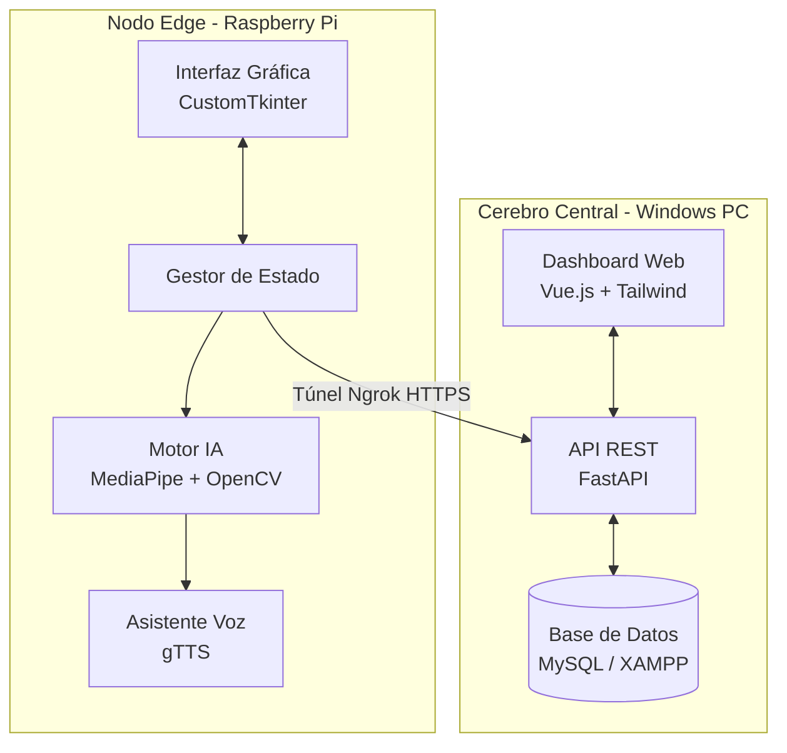
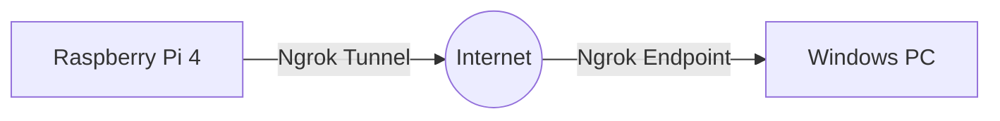
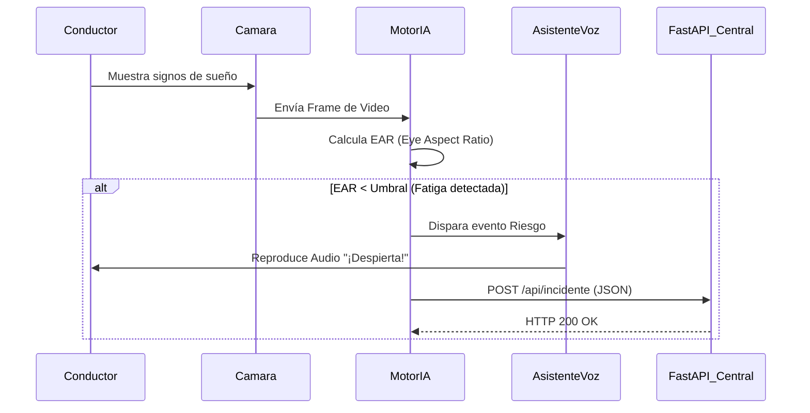
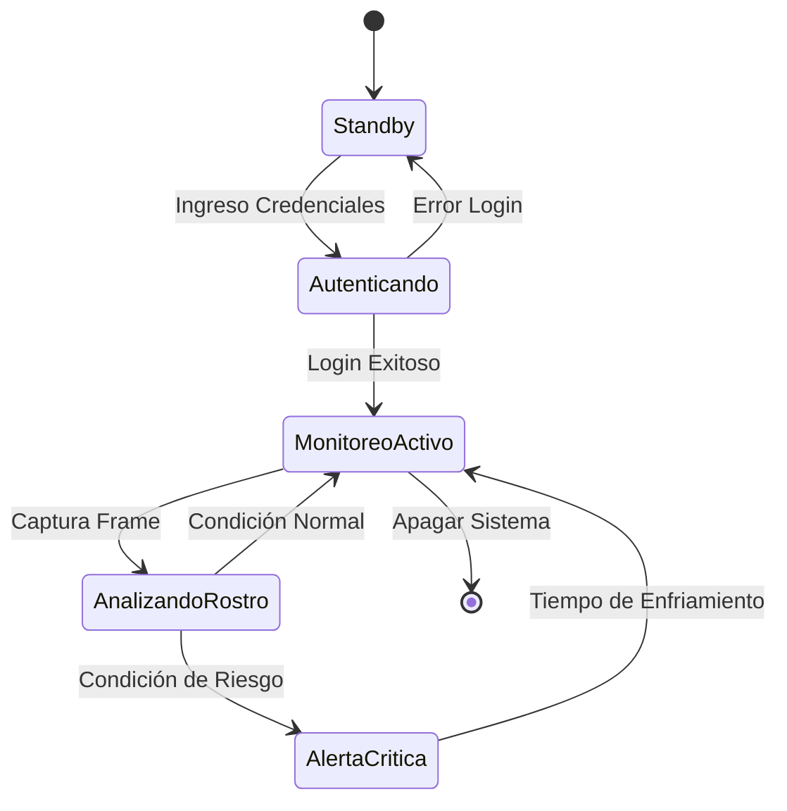

# Entregable 1: Requerimientos y Diseño del Sistema

## Portada
- **Título del sistema:** CopIA - Asistente de Conducción AI (Edge & Central Server)
- **Nombre del estudiante:** Cristhian Llanque
- **Semestre:** [Tu Semestre Actual]
- **Fecha:** Julio 2026

---

## Resumen Ejecutivo
CopIA es una solución integral de asistencia a la conducción diseñada para prevenir accidentes de tránsito causados por fatiga o distracción al volante. El sistema se compone de dos módulos principales: un **Nodo Edge (Raspberry Pi)** instalado en el vehículo que procesa video en tiempo real mediante Inteligencia Artificial (MediaPipe y OpenCV) para detectar somnolencia o falta de atención, y un **Cerebro Central (Servidor Windows)** que centraliza los datos, emite reportes y permite el monitoreo remoto por parte de la empresa de transportes a través de una aplicación web (Vue.js + FastAPI + MySQL). La comunicación entre ambos nodos se realiza de forma segura mediante túneles inversos (Ngrok).

El alcance del proyecto cubre desde la detección local en tiempo real hasta la persistencia y visualización de las métricas de conducción, ofreciendo alertas sonoras inmediatas al conductor y reportes estadísticos al administrador.

---

## Sección 1: Especificación de Requerimientos

### 1.1 Requerimientos Funcionales (RF)
- **RF01:** El sistema Edge debe capturar video en tiempo real utilizando una cámara conectada.
- **RF02:** El sistema Edge debe analizar los rostros usando IA para determinar el nivel de fatiga (bostezos, ojos cerrados) o distracción.
- **RF03:** El sistema Edge debe emitir alertas sonoras (mediante altavoces) cuando detecte un nivel de riesgo crítico.
- **RF04:** El sistema Edge debe requerir inicio de sesión del conductor antes de iniciar el monitoreo.
- **RF05:** El sistema Edge debe transmitir los eventos de riesgo al servidor central a través de una API REST.
- **RF06:** El Servidor Central debe almacenar los eventos de riesgo y sesiones en una base de datos relacional (MySQL).
- **RF07:** El Servidor Central debe exponer una interfaz web de administrador para visualizar el histórico de incidentes.
- **RF08:** El Servidor Central debe permitir el registro y gestión (CRUD) de conductores.

### 1.2 Requerimientos No Funcionales (RNF)
- **RNF01 (Rendimiento):** El análisis de video en el Edge debe ejecutarse a un mínimo de 15 cuadros por segundo (FPS) en una Raspberry Pi.
- **RNF02 (Conectividad):** El sistema debe manejar conexiones inestables, encolando eventos si el servidor central no responde.
- **RNF03 (Seguridad):** La comunicación entre Edge y el Servidor Central debe estar encriptada (HTTPS vía Ngrok).
- **RNF04 (Usabilidad):** La interfaz del conductor (Edge) debe ser táctil, con botones grandes y de alto contraste (Dark Mode).
- **RNF05 (Despliegue):** El servidor central debe poder inicializarse con un solo clic automatizado.

### 1.3 Reglas de Negocio
- **RN01:** Un conductor no puede iniciar un viaje sin antes autenticarse en el sistema.
- **RN02:** Se considera "Riesgo de Fatiga" cuando los ojos permanecen cerrados por más de 1.5 segundos consecutivos.

### 1.4 Restricciones del Sistema
- El nodo Edge está limitado al hardware de una Raspberry Pi y a su capacidad de procesamiento térmico (CPU).
- El software Edge se desarrolla en Python 3.11, utilizando entornos virtuales o Conda para garantizar compatibilidad de librerías.

### 1.5 Historias de Usuario
- **HU01:** Como *Conductor*, quiero *iniciar sesión en la pantalla táctil de mi vehículo* para *comenzar el monitoreo de mi viaje.*
- **HU02:** Como *Conductor*, quiero *recibir una alerta de voz inmediata* cuando *muestre signos de sueño*, para *evitar un accidente.*
- **HU03:** Como *Administrador de Flota*, quiero *ver un dashboard web con los incidentes de mis conductores* para *tomar decisiones preventivas.*

### 1.6 Criterios de Aceptación
- Para HU02: La alerta debe sonar en menos de 2 segundos de detectado el evento.
- Para HU03: El panel web debe cargar los datos desde MySQL usando endpoints de FastAPI con código HTTP 200.

---

## Sección 2: Prototipo Navegable

*Nota: Reemplazar los textos entre corchetes con las imágenes correspondientes ubicadas en la carpeta `imagenesllanque`.*

### 2.1 Flujo de Navegación
1. **Inicio:** Pantalla de Login en Edge -> Validación -> Dashboard de Conducción.
2. **Web:** Pantalla de Login Web -> Dashboard Central -> Gestión de Conductores.

### 2.2 Pantallas Principales
- **Pantalla Login Edge:** 
  
  *(Descripción: Interfaz oscura con CustomTkinter, solicitando ID y contraseña)*
- **Pantalla de Monitoreo Edge:**
  
  *(Descripción: Vista de la cámara con landmarks faciales y botones de control)*
- **Dashboard Web (Cerebro Central):**
  
  *(Descripción: Aplicación Vue.js mostrando tablas y estadísticas de MySQL)*

### 2.3 Evidencia de Validación
*(Adjuntar aquí el resumen de la prueba con usuarios simulados o feedback de los profesores)*

---

## Sección 3: Diseño Arquitectónico

### 3.1 Documento de Arquitectura
La arquitectura sigue un patrón **Edge-Cloud (Cliente-Servidor)**. El componente Edge procesa carga pesada (IA de visión) de forma descentralizada para garantizar latencia cero en las alertas. El Servidor opera como un monolito modular con Backend en Python (FastAPI) y Frontend en Javascript (Vue.js).

### 3.2 Diagrama de Componentes

### 3.3 Diagrama de Despliegue

### 3.4 Registro de Decisiones Arquitectónicas (ADRs)
- **ADR 01:** Uso de **CustomTkinter** en lugar de PyQt5 para el Edge debido a su ligereza y modernidad estética en pantallas táctiles de baja resolución.
- **ADR 02:** Uso de **Ngrok** para exposición de red debido a que las redes celulares en los vehículos manejan NAT estricto (CGNAT), impidiendo conexiones directas.

---

## Sección 4: Diseño Detallado

### 4.1 Diagrama de Secuencia (Detección de Fatiga)

### 4.2 Diagrama de Estados (Máquina de Estados del Edge)

---

## Anexos

### 5.1 Acta de Validación con Stakeholders
*(Insertar PDF o imagen escaneada del acta firmada o check-list de aceptación)*

### 5.2 Matriz de Trazabilidad de Requerimientos
| ID Requerimiento | Componente de Diseño Asociado | Prueba de Validación |
|------------------|-------------------------------|----------------------|
| RF01, RF02       | Motor IA (MediaPipe)          | Prueba en Cabina     |
| RF03             | AsistenteVoz (gTTS)           | Test de Audio        |
| RF06             | API (FastAPI) / DB (MySQL)    | Postman Test         |
| RNF04            | GUI (CustomTkinter)           | UX Review            |
