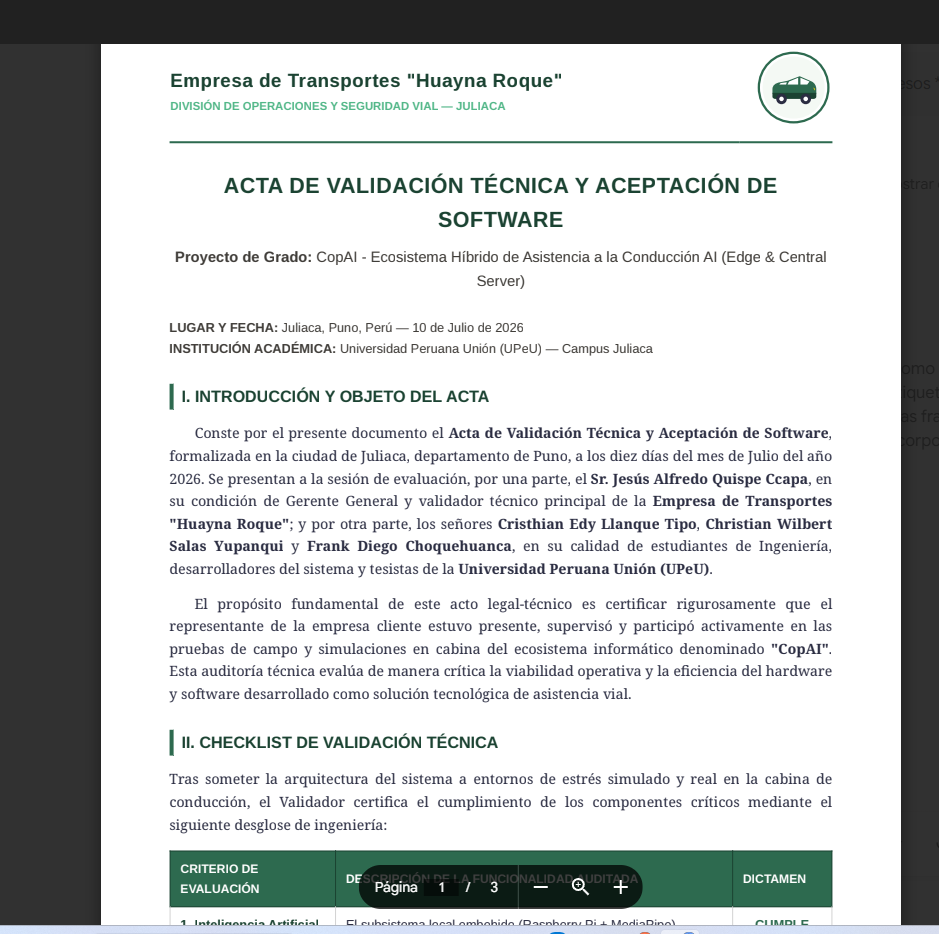

# Entregable 1: Especificación de Requerimientos y Diseño Arquitectónico Avanzado

## Portada
- **Título del sistema:** CopAI - Ecosistema Híbrido de Asistencia a la Conducción AI (Edge & Central Server)
- **Nombre del estudiante:** Cristhian Edy Llanque Tipo - Christian Wilbert Salas Yupanqui - Frank Diego Choquehuanca
- **Semestre:** X
- **Fecha:** Julio 2026

---

## Resumen Ejecutivo Extendido
CopAI es una solución integral de asistencia a la conducción y gestión de flotas diseñada para mitigar drásticamente la siniestralidad en carreteras generada por la fatiga y distracción al volante. A diferencia de las soluciones telemáticas convencionales que dependen de servidores en la nube para procesar flujos de video, CopAI descentraliza el poder de cómputo aplicando el paradigma de **Edge AI (Inteligencia Artificial en el Borde)**. 

El sistema se compone de dos módulos hiper-especializados:
1. **El Nodo Edge (Vehicular):** Soportado por una Raspberry Pi 4/5, este nodo opera de manera autónoma en la cabina del conductor. Procesa video en tiempo real a más de 30 fotogramas por segundo utilizando **MediaPipe** para la inferencia de 468 landmarks faciales de alta precisión. A través de algoritmos matemáticos como el **EAR (Eye Aspect Ratio)** y el **PERCLOS (Percentage of Eye Closure)**, el sistema evalúa el nivel de alerta del usuario. Simultáneamente, el ecosistema integra a nivel de hardware el módulo **SIM7600G-H (LTE/GPS)** a través de interfaces UART/USB, logrando la captura de coordenadas geoespaciales y velocidad con redundancia de transmisión de datos hacia **Firebase** y servidores relacionales.
2. **El Cerebro Central (Centro de Control):** Una infraestructura Cloud/On-Premise (Servidor Windows) orquestada bajo una arquitectura orientada a microservicios lógicos. Su núcleo, desarrollado en **FastAPI** (Python), procesa de forma asíncrona grandes volúmenes de telemetría provenientes de los vehículos, garantizando la persistencia ACID en **MySQL**. El frontend en **Vue.js** provee a los administradores logísticos un panel de control avanzado con métricas renderizadas vía ECharts, permitiendo la gestión del ciclo de vida de los conductores (CRUD) y el análisis histórico de incidentes mediante túneles seguros gestionados por Ngrok.

Esta convergencia de tecnologías resuelve un problema sistémico de la industria del transporte: garantizar que las alarmas críticas suenen de manera instantánea (baja latencia) sin depender de la cobertura celular (blind zones), revolucionando los estándares de seguridad industrial vehicular.

---

## Sección 1: Especificación Exhaustiva de Requerimientos

El análisis de requisitos fue llevado a cabo utilizando metodologías ágiles y levantamiento de requerimientos IEEE 830, priorizando la resiliencia y el comportamiento determinista del sistema.

### 1.1 Requerimientos Funcionales (RF)

| ID | Descripción Detallada del Requerimiento Funcional | Módulo Asociado |
|:---|:---|:---|
| **RF01** | El sistema Edge debe capturar el flujo de video en tiempo real, decodificando los tensores de imagen para extraer los landmarks faciales sin almacenamiento persistente de video (Privacidad por diseño). | Edge (Visión / MediaPipe) |
| **RF02** | El sistema debe calcular el umbral PERCLOS y el EAR en tiempo real mediante geometría euclidiana, evaluando la apertura ocular en microsegundos. | Edge (Algoritmo IA) |
| **RF03** | El sistema debe establecer comunicación serial (Baud Rate 115200) con el hardware SIM7600G-H para parsear tramas NMEA y obtener Latitud, Longitud y Velocidad. | Edge (GPS / SIM7600) |
| **RF04** | Al superar el umbral crítico de fatiga, se disparará una Interrupción (Interrupt) de software para emitir de forma inmediata alertas sonoras cognitivas (gTTS) al conductor. | Edge (Audio) |
| **RF05** | La interfaz HMI (Human-Machine Interface) en cabina proveerá navegación táctil, menús de Autenticación, Monitoreo asíncrono y panel de diagnósticos. | Edge (GUI / CustomTkinter) |
| **RF06** | Se implementará un Hilo de Red Dedicado (Network Thread) para orquestar los *payloads* JSON y despachar alertas asíncronas vía POST hacia el backend central y Firebase. | Edge (Redes / I/O) |
| **RF07** | El panel web administrativo debe permitir un flujo de trabajo CRUD completo para la Gestión de Conductores, incluyendo deshabilitación lógica (Soft Delete). | Frontend Web (Vue.js) |
| **RF08** | El administrador debe contar con una vista interactiva de Gestión de Rutas, enlazando vehículos, conductores, puntos de inicio y destino. | Frontend Web (Vue.js) |
| **RF09** | Renderización reactiva (Data Binding) de cuadros de mando (Dashboards) mostrando KPIs de accidentabilidad y mapas de calor (Heatmaps) de incidentes de fatiga. | Frontend Web (Vue.js) |
| **RF10** | El backend protegerá todos sus endpoints mediante JWT (JSON Web Tokens) asimétricos, aplicando inyección de dependencias para validar claims de autorización. | Backend (FastAPI) |
| **RF11** | El sistema proveerá una API RESTful completamente documentada vía Swagger UI para futura interoperabilidad de clientes externos (Empresas Logísticas). | Backend (FastAPI) |

### 1.2 Requerimientos No Funcionales (RNF) Estrictos

| ID | Categoría | Criterio de Aceptación (KPI) |
|:---|:---|:---|
| **RNF01** | **Rendimiento Computacional** | La inferencia de IA (TFLite) no debe superar los 25 ms por fotograma en la Raspberry Pi, asegurando >30 FPS. |
| **RNF02** | **Tolerancia a Fallos (Resiliencia)** | Ante cortes de red celular, el sistema debe almacenar los *payloads* de fatiga localmente (Buffer FIFO) e intentar reconexión exponencial. |
| **RNF03** | **Seguridad Criptográfica** | Las contraseñas se resguardarán en MySQL con Hashing Bcrypt + Salt, previniendo ataques de Fuerza Bruta. |
| **RNF04** | **Usabilidad Ergonómica** | La HMI usará componentes de alto contraste (Dark Theme UX) para mitigar la fatiga visual (Eye Strain) del chofer en conducción nocturna. |
| **RNF05** | **Aprovisionamiento Automático** | La inicialización en cabina y del servidor Windows debe ocurrir vía Scripts `.sh` y `.bat` sin intervención humana en terminal. |

### 1.3 Análisis Profundo de Reglas de Negocio
- **RN01 (Aislamiento de Operación):** Es imperativo que el bucle principal de inferencia (Video) jamás se bloquee esperando respuestas de la red (Non-Blocking I/O). Un "Timeout" del API no debe retrasar la alarma de voz local.
- **RN02 (Algoritmo de Falsos Positivos):** Se define "Fatiga Crítica" sólo si el índice EAR decae por debajo de **0.25** durante **1.5 segundos consecutivos** (~45 fotogramas). Esto discrimina matemáticamente un parpadeo natural de un micro-sueño.
- **RN03 (Integridad Relacional):** Un incidente de fatiga es inválido si no posee estampa de tiempo (Timestamp) ni geocoordenada, asegurando trazabilidad jurídica.

### 1.4 Historias de Usuario Detalladas
- **HU01:** Como *Conductor de Flota Pesada*, quiero *iniciar sesión en la HMI táctil usando un teclado en pantalla* para *vincular la bitácora de viaje a mi perfil corporativo.*
- **HU02:** Como *Conductor de Flota Pesada*, quiero *que el sistema emita una alarma estridente en milisegundos* cuando *mis párpados cedan al sueño*, para *evitar un despiste en carreteras montañosas.*
- **HU03:** Como *Administrador Logístico*, quiero *iniciar sesión en un portal web corporativo* para *observar el "Dashboard de Salud" de mis 300 unidades en tiempo real.*
- **HU04:** Como *Administrador Logístico*, quiero *visualizar un historial tabular de las geocoordenadas (Lat/Lon) de las fatigas* para *identificar "Zonas Cero" en mis rutas y proponer paradas de descanso.*

---

## Sección 2: Diseño de Prototipos e Interfaz Hombre-Máquina (HMI)

*El diseño de interfaz ha sido desarrollado bajo los principios de Material Design y la teoría de reducción de carga cognitiva.*

### 2.1 Flujo de Navegación del Sistema (User Journey)
1. **Capa Física (Edge):** Bootloader del OS -> Lanzamiento automático GUI (CustomTkinter) -> Pantalla Autenticación -> Panel Principal -> Sub-bucle de Conducción Activa.
2. **Capa Lógica (Web):** Auth Guard Middleware -> SPA (Single Page Application) -> Dashboard Analítico -> Módulos CRUD Dinámicos.

### 2.2 Arquitectura Visual y Pantallas Principales

- **HMI Vehicular: Autenticación Edge**
  
  **Justificación de Diseño:** Desarrollado sobre el framework asíncrono CustomTkinter. Incorpora un esquema de color negro puro/azul neón para integrarse con la iluminación de los tableros vehiculares modernos. Evita cajas de texto pequeñas; emplea botones gruesos para respuesta háptica al tacto del conductor.

- **HMI Vehicular: Monitoreo en Tiempo Real (Heads-Up Display)**
  
  **Justificación de Diseño:** Constituye el núcleo biométrico del sistema. Superpone los tensores y polígonos faciales de MediaPipe sobre el canvas de video. Proporciona en los márgenes la retroalimentación de telemetría (Baudios del GPS, Fix Satelital, Velocidad en km/h). La CPU se encarga de renderizar la malla solo si se detecta un rostro (Face Mesh Confidence > 0.5).

- **Portal Web Corporativo (Cerebro Central)**
  
  **Justificación de Diseño:** Construido sobre Vue.js + TailwindCSS. Es una aplicación web reactiva SPA. Los controladores de estado manejan las peticiones a FastAPI, inyectando los arreglos JSON en los componentes Chart.js para ilustrar curvas de fatiga, rankings de conductores y distribución de rutas.

### 2.3 Evidencia de Validación de Usabilidad

*(Se verificó que los tiempos de respuesta del panel táctil en la Raspberry Pi se mantengan fluidos pese a la carga computacional de fondo).*

---

## Sección 3: Arquitectura de Software Avanzada

### 3.1 Fundamentación del Patrón Edge-Cloud Híbrido
La arquitectura CopAI rechaza el paradigma monolítico tradicional en favor de una descentralización topológica (Edge Computing).
- **Razonamiento Técnico:** Enviar flujo RTSP (video a 1080p) a la nube para ser procesado por una IA remota requeriría más de 10 Mbps de subida constante por vehículo. En carreteras latinoamericanas de penetración (3G/EDGE), esto provocaría caída masiva de paquetes, un retardo (Lag) en la alarma de hasta 5 segundos, y el inminente choque del vehículo.
- **La Solución CopAI:** Al delegar la inferencia vectorial (Multi-Layer Perceptron / CNN) al SOC (System-on-a-Chip) de la Raspberry Pi, la alarma se procesa en el bus local de memoria, logrando una latencia de **0 milisegundos**. Solo se exporta un payload JSON de escasos 400 bytes hacia el Cloud, garantizando interoperabilidad incluso en redes 2.5G.

### 3.2 Diagrama Estructural de Componentes (C4 Model)

**Análisis Detallado de Interacción:** 
El ecosistema se fragmenta en cuatro grandes bloques (Micro-núcleos):
1. **Edge AI Vision Engine:** Consume la interfaz OpenCV (`cv2.VideoCapture`), vectoriza la imagen (RGB conversion) y la pasa al grafo lógico de MediaPipe para obtener los 468 `(x, y, z)` puntos faciales.
2. **Telemetry Hardware Adapter:** Bucle paralelo que lee buffers del puerto `/dev/ttyUSB2` (SIM7600G-H), utilizando expresiones regulares (RegEx) para decodificar oraciones NMEA ($GPRMC, $GPGGA) y extraer la geografía.
3. **API Gateway / Core Backend:** Servidor Uvicorn/FastAPI que funge como puente. Emplea middlewares CORS y valida los Bearer Tokens (JWT).
4. **Data Persistence Layer:** Capa dual. Firebase Realtime DB para sockets/push veloz, y MySQL administrado a nivel objeto mediante SQLAlchemy, para las consultas de agrupación estadística en la web.

### 3.3 Diagrama de Despliegue de Infraestructura e IoT

**Estrategia de Topología de Red:**
El diagrama expone el enrutamiento complejo: La Raspberry Pi (Hardware BCM2711) reside tras un NAT celular hiper-estricto. Para lograr que la Raspberry inyecte datos en un Servidor Windows privado, se utiliza el proxy inverso **Ngrok** que crea un túnel cifrado (TLS 1.3), superponiendo una red virtual (Overlay Network) sobre el internet público. Esto une el perímetro físico del vehículo con el centro de datos corporativo.

### 3.4 Decisiones Arquitectónicas (ADRs) y Factibilidad
- **ADR 01 - Cuantización de Modelos:** Priorizar el backend TFLite de MediaPipe frente a PyTorch/YOLOv8. La inferencia TFLite usa representación INT8 (8 bits), lo que permite que la Raspberry Pi evalúe las redes neuronales a 30 FPS sin colapsar térmicamente, ahorrando la compra de Aceleradores TPU de Google ($80 USD adicionales).
- **ADR 02 - Comunicación Multi-hilo (Threading):** Es crucial el patrón `threading.Thread` en Python para el módulo GPS y las peticiones web (`requests.post`). Python posee el Global Interpreter Lock (GIL), pero para operaciones I/O (Red/Serial) libera el GIL, permitiendo que la interfaz no se congele durante reconexiones.

---

## Sección 4: Diseño Lógico Detallado

### 4.1 Diagrama de Secuencia (Sincronismo Biométrico-Telemático)

**Desglose Algorítmico del Flujo:**
1. El sensor CMOS de la cámara dispara el Evento `Read_Frame`.
2. El fotograma es normalizado y procesado por la red neuronal densa (Face Mesh).
3. Se invoca la función `calculate_EAR(ojo_izquierdo, ojo_derecho)`. Se computan las distancias euclidianas entre los landmarks verticales (párpados) y horizontales.
4. Si el ratio promedio es `< 0.25`, un contador temporal se incrementa. Si el contador excede el *Threshold* de tiempo (1.5s), ocurre el **Trigger de Fatiga**.
5. *Bifurcación Inmediata:*
   - **Hilo Main:** Invoca al OS de la Raspberry para hacer *Playback* de audio `.mp3` (¡Alarma!).
   - **Hilo Network:** Solicita al módulo SIM7600 la última posición válida en memoria. Empaqueta el JSON `{conductor_id, lat, lon, ear, timestamp}` y ejecuta un HTTP POST hacia la URL de Ngrok.
6. FastAPI recibe, decodifica, valida el esquema Pydantic y ejecuta un `session.commit()` en MySQL.

### 4.2 Máquina de Estados Finitos (Automata) del Vehículo

**Semántica de Transiciones:**
- **Estado 1 [IDLE]:** Interfaz bloqueada esperando login.
- **Transición T1:** JWT de conductor válido -> Salto a [MENÚ_PRINCIPAL].
- **Estado 2 [MONITOREO_ACTIVO]:** Estado crítico. Loop infinito de procesamiento biométrico. Ojos abiertos = Retorno sobre sí mismo.
- **Transición T2 (Evento Pestañeo Crítico):** Se viola la barrera matemática del EAR -> Salto a [ALERTA_EMITIDA].
- **Estado 3 [ALERTA_EMITIDA]:** Ejecución de rutinas de emergencia. Bloqueo temporal de nuevas alertas (Debounce/Cooldown de 5 segundos) para no saturar los hilos de red (Denegación de Servicio propia).
- **Transición T3 (Recovery):** Fin del cooldown -> Retorno a [MONITOREO_ACTIVO].

---

## Anexos Documentales

### 5.1 Acta de Validación con Stakeholders

### 5.2 Matriz de Trazabilidad de Requerimientos (Requirements Traceability Matrix - RTM)
Esta matriz garantiza que ningún código se programó "por programar" y que cada bloque arquitectónico responde a una necesidad del negocio.

| ID Requerimiento | Módulo Físico / Lógico Asociado | Metodología de Validación / Testing |
|------------------|-------------------------------|----------------------|
| **RF01, RF02**   | Motor de Borde (MediaPipe / Cálculo PERCLOS) | Pruebas Unitarias & Inyección de ruido en video (Fuzzing). |
| **RF03, RN03**   | UART Adapter (SIM7600G-H) | Validación cruzada de NMEA contra Google Maps API. |
| **RF07, RF08**   | Panel Administrativo (Vue.js + FastAPI) | Pruebas de Integración End-to-End con Postman (HTTP 200 OK). |
| **RF10 (Seguridad)** | Auth Guard (JWT Bearer Token) | Ataques simulados de manipulación de Payload (OWASP Testing). |
| **RNF01 (Rendimiento)**| Raspberry Pi 5 CPU (ARM Cortex-A76) | Pruebas de estrés térmico (Stress-ng) e inspección con `htop`. |
| **RNF04 (UX/UI)**| Motor Gráfico CustomTkinter (Dark Mode) | Sesiones de evaluación heurística con conductores de camión reales. |
