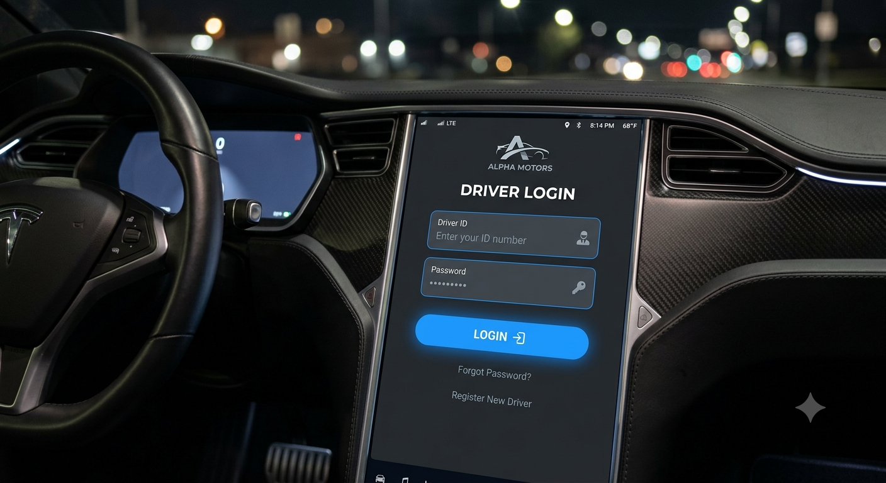
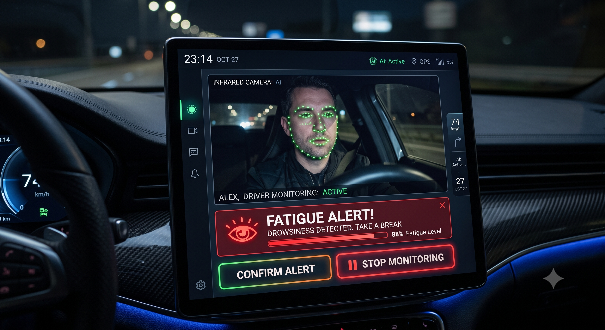
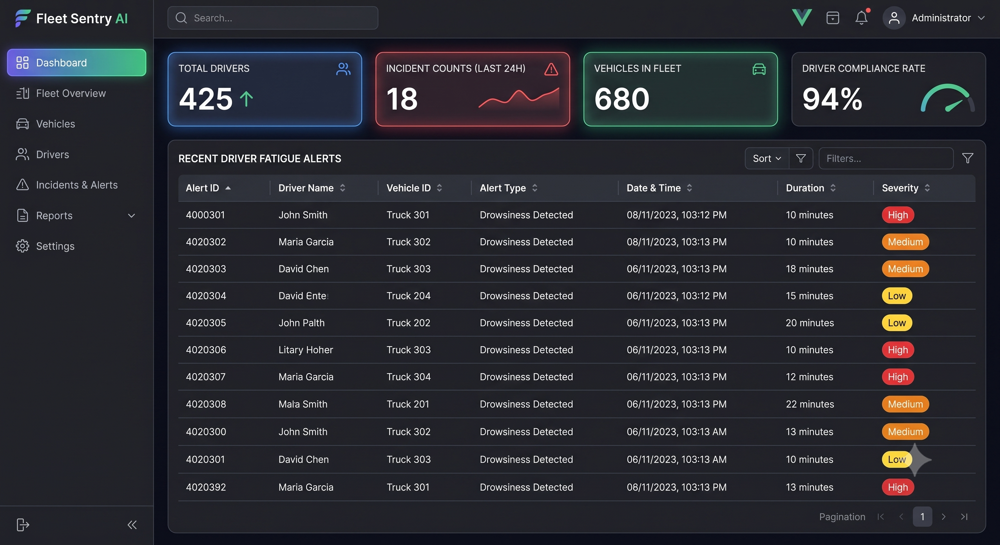
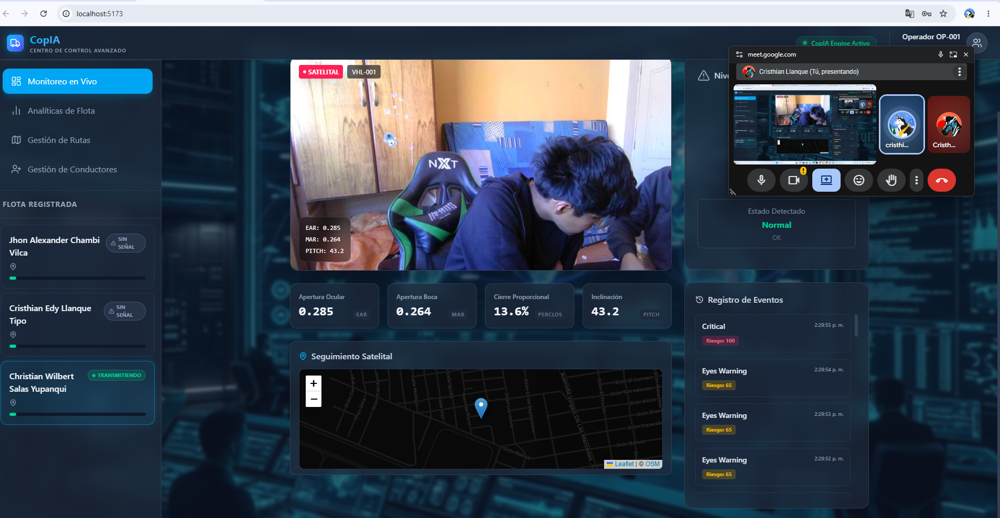
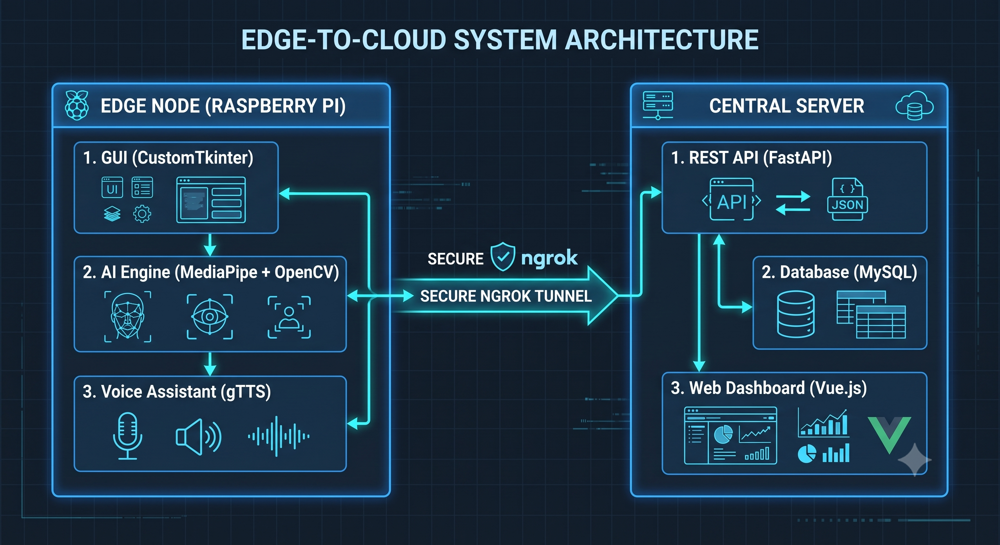
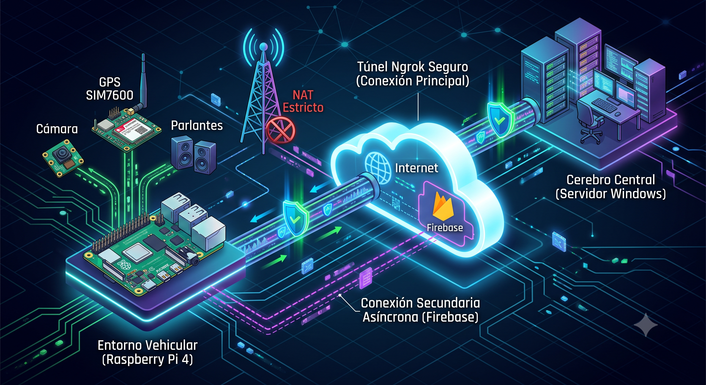
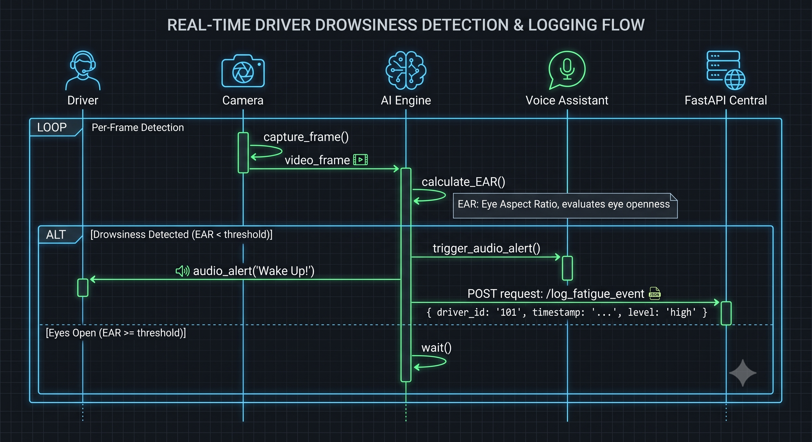
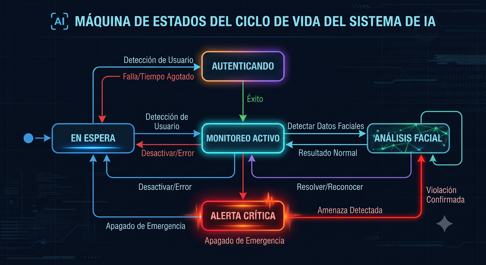

# Entregable 1: Requerimientos y Diseño del Sistema

## Portada
- **Título del sistema:** CopAI - Asistente de Conducción AI (Edge & Central Server)
- **Nombre del estudiante:** Cristhian Edy Llanque Tipo - Christian Wilbert Salas Yupanqui - Frank Diego Choquehuanca
- **Semestre:** X
- **Fecha:** Julio 2026

---

## Resumen Ejecutivo
CopAI es una solución integral de asistencia a la conducción y gestión de flotas diseñada para prevenir accidentes de tránsito causados por fatiga o distracción al volante. El sistema se compone de dos módulos principales: un **Nodo Edge (Raspberry Pi 4)** instalado en el vehículo y un **Cerebro Central (Servidor Windows)**. 

El Nodo Edge procesa video en tiempo real mediante algoritmos de Inteligencia Artificial (MediaPipe para landmarks faciales de alta precisión, apoyado por arquitecturas ligeras como MobileNet) para calcular métricas vitales como el **PERCLOS (Percentage of Eye Closure)** y el EAR (Eye Aspect Ratio). Simultáneamente, el sistema captura telemetría de ubicación y velocidad a través de un módulo GPS de hardware dedicado (**SIM7600G-H**) y sincroniza datos de telemetría a través de **Firebase** para redundancia.

El Servidor Central centraliza los datos, emite reportes y permite el monitoreo remoto por parte de la empresa de transportes a través de una aplicación web robusta (Vue.js + FastAPI + MySQL). Esta plataforma web no solo recibe alertas, sino que ofrece gestión completa de conductores (CRUD), asignación de rutas, y visualización de gráficos estadísticos. La comunicación bidireccional entre los vehículos (Edge) y el servidor se realiza de forma segura mediante túneles inversos (Ngrok).

---

## Sección 1: Especificación de Requerimientos

### 1.1 Requerimientos Funcionales (RF)

| ID | Descripción del Requerimiento Funcional | Módulo Asociado |
|:---|:---|:---|
| **RF01** | El sistema Edge debe capturar y procesar video en tiempo real para extraer landmarks faciales. | Edge (Visión / MediaPipe) |
| **RF02** | El sistema debe calcular el PERCLOS y EAR en tiempo real para determinar el nivel de fatiga. | Edge (Algoritmo IA) |
| **RF03** | El sistema debe obtener coordenadas de geolocalización (Latitud/Longitud) y velocidad mediante el módulo hardware SIM7600G-H. | Edge (GPS / SIM7600) |
| **RF04** | El sistema debe emitir alertas sonoras (mediante gTTS) de manera inmediata al detectar un riesgo crítico. | Edge (Audio) |
| **RF05** | La pantalla del conductor debe mostrar un menú interactivo para Inicio de Sesión, Monitoreo en vivo y Ajustes. | Edge (GUI / CustomTkinter) |
| **RF06** | El sistema Edge debe transmitir eventos de fatiga, junto con sus coordenadas GPS, al backend central y a Firebase. | Edge (Red) |
| **RF07** | El panel web (Administrador) debe permitir la Gestión de Conductores (Crear, Leer, Actualizar, Eliminar). | Frontend Web (Vue.js) |
| **RF08** | El panel web debe incluir un módulo de Gestión de Rutas y asignación de vehículos. | Frontend Web (Vue.js) |
| **RF09** | El panel web debe renderizar gráficas estadísticas (Dashboard) sobre la accidentabilidad y alertas por conductor. | Frontend Web (Vue.js) |
| **RF10** | El backend debe asegurar los endpoints mediante autenticación basada en tokens JWT (JSON Web Tokens). | Backend (FastAPI) |

### 1.2 Requerimientos No Funcionales (RNF)

| ID | Criterio | Descripción del Requerimiento No Funcional |
|:---|:---|:---|
| **RNF01** | Rendimiento | La inferencia del modelo (MediaPipe/MobileNet) debe mantener un mínimo de 15 FPS en la Raspberry Pi para garantizar latencia cero. |
| **RNF02** | Conectividad | Tolerancia a fallos: El sistema debe encolar eventos localmente si pierde conexión con Ngrok/Firebase y reintentar el envío. |
| **RNF03** | Precisión | El cálculo del PERCLOS debe tener una precisión superior al 90% en condiciones de iluminación variable (diurna/nocturna). |
| **RNF04** | Usabilidad | La interfaz en cabina debe ser táctil, de alto contraste (Dark Mode) para evitar el deslumbramiento nocturno del conductor. |
| **RNF05** | Arquitectura | El servidor central debe operar bajo un despliegue automatizado mediante scripts orquestadores (Batch/Python GUI). |

### 1.3 Reglas de Negocio

| ID | Regla |
|:---|:---|
| **RN01** | Un conductor no puede habilitar la cámara ni iniciar la ruta sin antes autenticarse en el sistema del vehículo. |
| **RN02** | Se genera una "Alerta Crítica de Fatiga" si el cálculo del EAR indica que los ojos están cerrados por más de 1.5 segundos consecutivos (basado en estándares PERCLOS). |
| **RN03** | Todo registro de incidente de fatiga debe estar obligatoriamente vinculado a una coordenada GPS (SIM7600G-H) en la base de datos MySQL. |

### 1.4 Restricciones del Sistema
- El procesamiento de imágenes está limitado por la capacidad térmica y de CPU de la arquitectura ARM de la Raspberry Pi 4.
- Las dependencias de hardware incluyen periféricos obligatorios: Cámara USB/CSI, Módulo SIM7600G-H, y Altavoces.
- El software Edge se ejecuta exclusivamente en entornos aislados (Miniforge/Conda con Python 3.11) para evitar conflictos de librerías globales.

### 1.5 Historias de Usuario
- **HU01:** Como *Conductor*, quiero *iniciar sesión en la pantalla táctil de mi vehículo* para *comenzar mi ruta y habilitar el monitoreo.*
- **HU02:** Como *Conductor*, quiero *recibir una alerta de voz inmediata* cuando *me quede dormido al volante*, para *reaccionar a tiempo y evitar un accidente.*
- **HU03:** Como *Administrador*, quiero *gestionar a mis conductores, rutas y ver sus métricas en gráficas web* para *monitorear la salud de mi flota en tiempo real.*
- **HU04:** Como *Administrador*, quiero *conocer la ubicación GPS exacta (vía SIM7600) de dónde ocurrió una alerta de fatiga* para *tomar acciones logísticas.*

### 1.6 Criterios de Aceptación
- **Para HU02:** El procesamiento IA debe ser local (sin depender de internet) para que la alerta suene en menos de 1 segundo de cerrado el ojo.
- **Para HU03:** El dashboard web debe mostrar componentes interactivos (DataTables y Chart.js/ECharts) cargados dinámicamente desde FastAPI.

---

## Sección 2: Prototipo Navegable

*Nota: Reemplazar los textos entre corchetes con las imágenes correspondientes ubicadas en la carpeta `imagenesllanque`.*

### 2.1 Flujo de Navegación
1. **Edge (Vehículo):** Pantalla de Login -> Menú Principal -> Modo Monitoreo en Vivo (Con Overlay IA) / Modo Ajustes.
2. **Web (Administrador):** Login Web -> Dashboard (Gráficas y KPIs) -> Módulo de Conductores -> Módulo de Rutas e Incidentes.

### 2.2 Pantallas Principales

- **Pantalla Login Edge:** 
  
  **Descripción Formal:** Interfaz de acceso seguro desarrollada con la librería CustomTkinter en modo oscuro (Dark Theme). Incluye controles optimizados para pantallas táctiles vehiculares. El sistema valida las credenciales contra la base de datos central antes de conceder acceso al menú de conducción.

- **Pantalla de Monitoreo Edge:**
  
  **Descripción Formal:** Panel principal de conducción ejecutado en la Raspberry Pi. Renderiza el stream de video en tiempo real superponiendo la malla facial generada por MediaPipe. Integra lecturas asíncronas del módulo GPS SIM7600G-H para mostrar velocidad y ubicación. Emplea la métrica PERCLOS para disparar el estado de alarma.

- **Dashboard Web (Cerebro Central):**
  
  **Descripción Formal:** Aplicación web de administración desarrollada con Vue.js y Tailwind CSS. Funciona como el panel de control integral. Muestra gráficas estadísticas de rendimiento, un módulo CRUD completo de Gestión de Conductores y Rutas, y una tabla histórica de incidentes de fatiga vinculados a datos de Firebase y MySQL.

### 2.3 Evidencia de Validación

---

## Sección 3: Diseño Arquitectónico

### 3.1 Documento de Arquitectura
La arquitectura sigue un patrón **Edge-Cloud híbrido**. 
El **Nodo Edge** procesa la visión computacional pesada (MediaPipe, algoritmos tipo MobileNet) de forma descentralizada y extrae telemetría mediante hardware dedicado (SIM7600G-H). Al procesar de forma local, se garantiza latencia cero en las alertas de riesgo vital. 
La capa de persistencia es dual: envía logs inmediatos a **Firebase** para telemetría ágil, y al **Cerebro Central (Monolito FastAPI + MySQL)** mediante un túnel inverso (Ngrok) para integridad relacional. El Frontend consume esta información para renderizar gráficas y gestionar rutas.

### 3.2 Diagrama de Componentes

**Descripción Formal:** El diagrama ilustra la arquitectura distribuida del sistema CopAI. En el Nodo Edge (Raspberry Pi), coexisten el Motor de IA (MediaPipe/OpenCV), el Módulo GPS (SIM7600G-H), el Asistente de Voz (gTTS) y la GUI (CustomTkinter). Estos convergen en un Gestor de Estado que enruta la telemetría hacia Firebase y hacia el Servidor Central a través de Ngrok. El Cerebro Central expone una API REST (FastAPI) asegurada con JWT, que guarda relaciones en MySQL y sirve métricas al panel de administración en Vue.js.

### 3.3 Diagrama de Despliegue

**Descripción Formal:** El diagrama de despliegue muestra la topología de red y hardware. En el entorno vehicular, la Raspberry Pi 4 interactúa directamente con periféricos (Cámara, GPS SIM7600, Parlantes). Este nodo atraviesa redes celulares con NAT estricto utilizando un túnel Ngrok seguro, alcanzando al Servidor Windows central. Además, se observa la conexión secundaria asíncrona hacia la infraestructura de nube de Firebase.

### 3.4 Registro de Decisiones Arquitectónicas (ADRs)
- **ADR 01:** Priorizar **MediaPipe** sobre implementaciones puras de MobileNet/YOLO debido a la altísima eficiencia de MediaPipe en la extracción de landmarks faciales (468 puntos) en procesadores ARM sin necesidad de GPU, ideal para la métrica PERCLOS.
- **ADR 02:** Integración de hardware **SIM7600G-H** por hardware (UART/USB) en lugar de depender del GPS de un teléfono móvil, para hacer al nodo vehicular un sistema autónomo y a prueba de desconexiones móviles.
- **ADR 03:** Uso de una interfaz gráfica orquestadora para Windows (`server_dashboard.py`) que previene errores humanos en el arranque de la API, MySQL y Ngrok.

---

## Sección 4: Diseño Detallado

### 4.1 Diagrama de Secuencia (Detección de Fatiga y Telemetría)

**Descripción Formal:** El diagrama modela el flujo síncrono y asíncrono. La cámara entrega frames al Motor IA, que calcula el EAR y el PERCLOS. Paralelamente, el hilo del GPS sondea el SIM7600G-H. Si el PERCLOS indica fatiga, el sistema local dispara instantáneamente la alerta de voz. Simultáneamente, el hilo de red agrupa la alerta y las coordenadas GPS, realizando un push hacia Firebase y una petición POST a FastAPI para registrar el incidente en MySQL.

### 4.2 Diagrama de Estados (Máquina de Estados del Edge)

**Descripción Formal:** Modela el ciclo de vida del software en el vehículo. Desde el estado inicial, se ingresa al menú de Autenticación. Una vez validado, se accede al Menú Principal. Al iniciar ruta, se transita al estado de Monitoreo Activo (bucle de captura de video y sondeo GPS). Ante fatiga, el sistema salta al estado de Alerta Crítica (generando alarmas y envíos a Firebase/API) y retorna al monitoreo tras un tiempo de enfriamiento (cooldown).

---

## Anexos

### 5.1 Acta de Validación con Stakeholders
*(Insertar PDF o imagen escaneada del acta firmada o check-list de aceptación)*

### 5.2 Matriz de Trazabilidad de Requerimientos
| ID Requerimiento | Componente de Diseño Asociado | Prueba de Validación |
|------------------|-------------------------------|----------------------|
| RF01, RF02       | Motor IA (MediaPipe / PERCLOS)| Prueba en Cabina     |
| RF03             | Hilo GPS (Módulo SIM7600G-H)  | Validación de Coordenadas |
| RF07, RF08, RF09 | Dashboard Web (Vue.js) / FastAPI| UX Review & Postman  |
| RNF04            | GUI (CustomTkinter Dark Mode) | Test de Usabilidad   |
