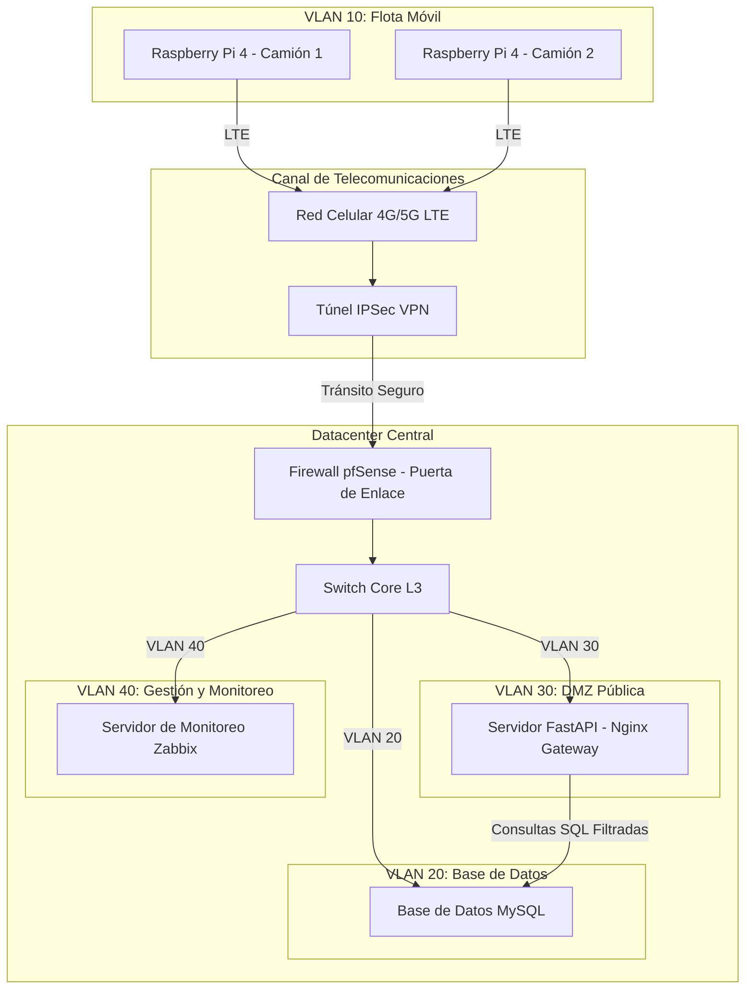

# Entregable 1: Diseño de Red (Alineado con CE0311)

## Portada
* **Título del Proyecto:** CopIA - Asistente de Conducción AI (Edge & Central Server)
* **Línea de Evaluación:** CE03: Infraestructura Tecnológica
* **Entregable:** Entregable 1: Diseño de Red (CE0311)
* **Responsable:** Frank Choquehuanca
* **Semestre:** X
* **Fecha:** Julio 2026

---

## Resumen Ejecutivo
El presente documento detalla el diseño conceptual y lógico de la infraestructura de conectividad para el sistema **CopIA**. La arquitectura propuesta separa el procesamiento en cabina de los camiones (Nodo Edge) del núcleo de datos central (Datacenter). Se describe el dimensionamiento del ancho de banda necesario para soportar telemetría concurrente y streaming de video, la segmentación lógica mediante VLANs para mitigar riesgos de seguridad, y las estrategias de redundancia y alta disponibilidad tanto a nivel celular como en el Datacenter. Todo el diseño se encuentra alineado bajo estándares internacionales de cableado y transmisión de datos.

---

## Sección 1: Levantamiento de Requerimientos de Red

Para garantizar la viabilidad técnica del sistema CopIA a gran escala, se definen los siguientes requerimientos de ancho de banda y rendimiento:

* **Tráfico de Telemetría JSON**: Cada vehículo equipado con el cliente de cabina (`raspberry_client.py`) envía un paquete JSON de telemetría cada **3 segundos** con un tamaño promedio de **1.2 KB**. Esto requiere un ancho de banda constante de:
  $$\text{Ancho de Banda por Camión} = \frac{1.2\text{ KB} \times 8\text{ bits}}{3\text{ s}} = 3.2\text{ kbps}$$
* **Tráfico de Streaming de Video en Vivo**: Bajo demanda del operador, se realiza streaming MJPEG (`/api/video_feed`). Cada frame en resolución $640 \times 480$ comprimido al 70% de calidad JPEG pesa **35 KB**. A una tasa de refresco de 15 FPS, el consumo por streaming activo es:
  $$\text{Ancho de Banda de Video} = 35\text{ KB} \times 15\text{ FPS} \times 8\text{ bits} = 4,200\text{ kbps} \approx 4.2\text{ Mbps}$$
* **Concurrencia Estimada (Flota Actual: 150 Vehículos)**: Se dimensiona la red para soportar la flota de 150 camiones transmitiendo telemetría en tiempo real de forma simultánea, y hasta 5 streamings de video concurrentes:
  $$\text{Ancho de Banda Total Requerido} = (150 \times 3.2\text{ kbps}) + (5 \times 4.2\text{ Mbps}) \approx 480\text{ kbps} + 21\text{ Mbps} \approx 21.48\text{ Mbps}$$
* **Requerimientos de Negocio**:
  * Monitoreo constante e ininterrumpido de la flota durante jornadas de hasta 12 horas.
  * Tiempos de alerta críticos inferiores a 1 segundo transmitidos localmente.
  * Centralización histórica de la ubicación y severidad de alertas para auditoría vial corporativa.

---

## Sección 2: Diseño de Topología Lógica de Red

La topología de red de CopIA separa la flota de vehículos móviles del Datacenter central mediante un túnel seguro **IPSec VPN** sobre redes móviles 4G/5G, canalizando el flujo a través de un Firewall perimetral hacia la zona desmilitarizada (DMZ).

### Segmentación de Red (VLANs)

Para mitigar riesgos de seguridad y organizar el dominio de difusión de red, se implementa una segmentación basada en **VLANs (IEEE 802.1Q)** con el siguiente direccionamiento privado:

| VLAN ID | Nombre de Subred | Propósito | Rango IP / Máscara | Puerta de Enlace (Gateway) |
| :--- | :--- | :--- | :--- | :--- |
| **VLAN 10** | VLAN_FLOTA | Clientes IoT de cabina (Raspberry Pi) | `10.100.10.0/24` | `10.100.10.1` |
| **VLAN 20** | VLAN_DB | Servidores de base de datos MySQL internos | `192.168.20.0/24` | `192.168.20.1` |
| **VLAN 30** | VLAN_DMZ | Servidor Web de Frontend y API Gateway FastAPI | `192.168.30.0/24` | `192.168.30.1` |
| **VLAN 40** | VLAN_MGT | Servidor de monitoreo (Zabbix) e interfaces de red | `192.168.40.0/24` | `192.168.40.1` |

---

## Sección 3: Incorporación de Redundancia y Alta Disponibilidad

* **En el Vehículo (Edge HA)**: Las Raspberry Pi integran un módem USB dual-SIM compatible con failover automático. Si la conexión con el operador de telecomunicaciones principal (ej. Claro) se interrumpe o pierde potencia, el módem conmuta en menos de **5 segundos** al operador de respaldo (ej. Movistar).
* **En el Datacenter (Core HA)**: El Switch Core L3 y el Firewall pfSense se configuran en alta disponibilidad mediante **CARP (Common Address Redundancy Protocol)** en el firewall y **HSRP/VRRP** en el switch de capa 3, previniendo caídas ante fallos de hardware en los enlaces de fibra óptica redundantes del proveedor WAN.

---

## Sección 4: Cumplimiento de Estándares Internacionales

Para garantizar la interoperabilidad, escalabilidad y durabilidad de la infraestructura de red, el diseño cumple estrictamente con los siguientes estándares internacionales:

1. **IEEE 802.1Q (VLAN Tagging)**:
   * Define la inserción de una etiqueta (tag) en la trama Ethernet para identificar la pertenencia a una red de área local virtual. Esto nos permite estructurar el Datacenter en 4 segmentos lógicos aislados (VLAN 10, 20, 30 y 40) sobre un único switch físico principal.
2. **TIA/EIA-568-D (Cableado Estructurado)**:
   * Estándar utilizado para el diseño y tendido de cableado de par trenzado de cobre (Categoría 6A) y enlaces de fibra óptica (OM4) en el Datacenter central. Garantiza anchos de banda estables de hasta 10 Gbps a distancias de 100 metros en el switch core y servidores.
3. **ISO/IEC 11801**:
   * Especifica sistemas de cableado genérico de telecomunicaciones para locales de clientes. Asegura que los componentes de cableado cumplan con las especificaciones de rendimiento para redes de transporte rápido.
4. **IEEE 802.3ae (10 Gigabit Ethernet)**:
   * Define las especificaciones físicas para enlaces de 10 Gbps sobre fibra óptica. Utilizado para interconectar el switch de distribución/core con el hipervisor de servidores Proxmox, garantizando que el cuello de botella físico sea inexistente en el núcleo.

---

## Anexos
1. **Diagramas Físicos Complementarios**: Especificaciones de acometidas eléctricas de enlaces WAN del Datacenter.
2. **Lista Detallada de Requerimientos de Hardware de Conectividad**: Fichas técnicas del Firewall pfSense (Netgate 6100) y Switch Cisco Catalyst 9300.
