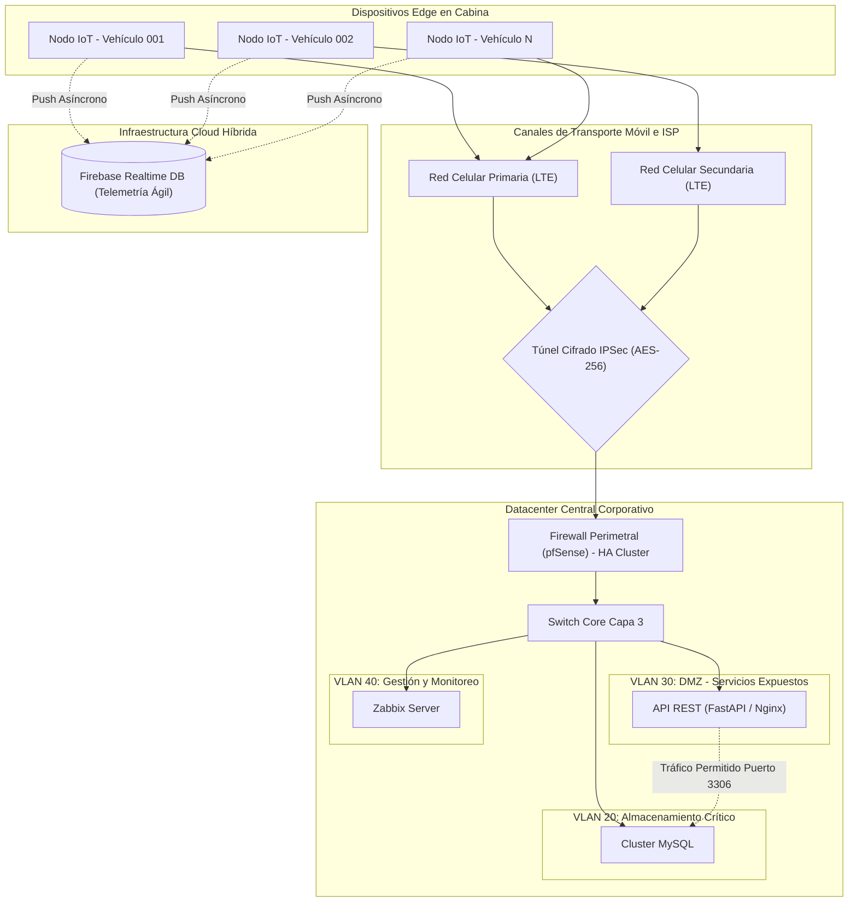

# Entregable 1: Diseño de Red (Alineado con CE0311)

## Portada
* **Título del Proyecto:** CopIA - Asistente de Conducción AI (Edge & Central Server)
* **Línea de Evaluación:** CE03: Infraestructura Tecnológica
* **Competencia:** CE0311 - Diseño de Red
* **Responsable:** Frank Choquehuanca
* **Semestre:** X
* **Fecha:** Julio 2026

---

## Resumen Ejecutivo

El presente documento constituye el diseño conceptual, lógico y físico de la infraestructura de conectividad de misión crítica para el sistema **CopIA**. La necesidad primordial de este proyecto radica en interconectar de forma segura y con baja latencia una flota distribuida geográficamente de vehículos pesados (equipados con nodos Edge de procesamiento AI) con un núcleo de datos centralizado (Datacenter). 

Para lograr este objetivo, la arquitectura de red propuesta se divide en dos grandes frentes bajo un modelo de nube híbrida. El primero es la conectividad móvil (WAN), fundamentada en túneles cifrados sobre infraestructuras celulares 4G/5G con capacidades de failover automático, respaldada por una sincronización asíncrona hacia la nube pública (Firebase) para telemetría ágil. El segundo frente es la infraestructura de área local (LAN) en el Datacenter On-Premise, la cual ha sido diseñada bajo estrictos principios de seguridad de defensa en profundidad. 

En el núcleo de datos, se ha implementado una segmentación lógica estricta mediante el estándar IEEE 802.1Q (VLANs), aislando físicamente el tráfico de la flota, las bases de datos de almacenamiento masivo, los servidores de inferencia web en una zona desmilitarizada (DMZ) y los canales de gestión administrativa. Todo el diseño de red, desde el tendido de fibra óptica y cableado estructurado hasta la configuración de alta disponibilidad (CARP/HSRP), se ha estructurado para cumplir rigurosamente con los lineamientos de la industria de telecomunicaciones, incluyendo TIA/EIA-568 e ISO/IEC 11801, asegurando un entorno escalable, seguro y auditable.

---

## Sección 1: Levantamiento de Requerimientos de Red

El diseño de red de CopIA no se basa en estimaciones empíricas, sino en un análisis cuantitativo de la volumetría de datos que la inteligencia artificial en cabina genera. A continuación se detallan los requerimientos funcionales y no funcionales, seguidos de su dimensionamiento.

### 1.1 Requerimientos Funcionales y No Funcionales de Conectividad

| ID | Tipo | Descripción del Requerimiento | Criterio de Aceptación |
| :--- | :--- | :--- | :--- |
| **REQ-R01** | Funcional | El sistema debe transmitir la telemetría del conductor (niveles de EAR, MAR, Pitch) desde el camión hacia el Datacenter en tiempo real. | La transmisión debe realizarse vía túnel IPSec utilizando la red celular disponible. |
| **REQ-R02** | Funcional | El centro de control debe poder solicitar un flujo de video en vivo (streaming) de cualquier cámara en cabina bajo demanda. | Transmisión fluida de MJPEG a 15 FPS con resolución mínima de 640x480. |
| **REQ-R03** | No Funcional (Disponibilidad) | Los enlaces de telecomunicaciones en la cabina deben poseer redundancia ante la pérdida de cobertura de un operador. | Failover automático a un segundo proveedor SIM en menos de 5 segundos. |
| **REQ-R04** | No Funcional (Seguridad) | El tráfico de base de datos en el Datacenter debe estar aislado de cualquier red con salida directa a internet. | Implementación obligatoria de VLAN dedicada sin ruta por defecto al ISP. |
| **REQ-R05** | No Funcional (Rendimiento) | La latencia end-to-end de transmisión de alertas críticas no debe superar los 150 milisegundos. | Ping promedio desde el Edge al Core <= 120 ms. |

### 1.2 Dimensionamiento de Ancho de Banda y Tráfico

Para garantizar la viabilidad técnica del sistema a escala corporativa, se ha modelado el tráfico de red de la siguiente manera:

* **Tráfico de Telemetría (Paquetes JSON)**: 
  El agente IoT embebido (`raspberry_client.py`) genera un *payload* JSON de telemetría de **1.2 KB** de tamaño promedio. Para mantener una latencia mínima de reacción, este paquete se envía cada **3 segundos**. 
  - Consumo por vehículo = (1.2 KB * 8 bits) / 3 s = 3.2 kbps

* **Tráfico de Streaming de Video (MJPEG)**: 
  El análisis visual remoto requiere transmisión de video. Un frame de 640 x 480 comprimido con calidad JPEG (70%) pesa aproximadamente **35 KB**. Transmitiendo a 15 FPS:
  - Consumo de Video = 35 KB * 15 FPS * 8 bits = 4,200 kbps (Aprox 4.2 Mbps)

* **Escenario de Concurrencia (Flota de 150 Vehículos)**: 
  El Datacenter debe estar en capacidad de recibir la telemetría concurrente de toda la flota operando simultáneamente, y mantener hasta 5 conexiones de streaming de video simultáneas para auditorías en vivo por parte del centro de control:
  - Tráfico Telemetría = 150 * 3.2 kbps = 480 kbps
  - Tráfico Video = 5 * 4.2 Mbps = 21 Mbps
  - **Ancho de Banda Total de Ingesta = 21.48 Mbps**

Dado que el requerimiento de ingesta es de aprox 21.5 Mbps, el Datacenter se proveerá de un enlace de fibra óptica dedicado de **100 Mbps (Simétrico, 1:1)** para garantizar un margen de tolerancia a picos de tráfico (bursts) y escalabilidad futura hasta 500 vehículos.

---

## Sección 2: Diseño de Topología y Segmentación

### 2.1 Topología Lógica de Red

La infraestructura se diseña bajo un modelo jerárquico modificado, donde se prioriza la seguridad perimetral para los nodos Edge (IoT). 

### 2.2 Justificación de Decisiones Tecnológicas (Marco Teórico)

**Firewall Perimetral: pfSense vs Fortinet**
Para el nodo de terminación de VPN y firewall de borde, se optó por **pfSense (Netgate)** sobre soluciones privativas como Fortinet FortiGate o Cisco ASA. La decisión radica en que pfSense, basado en FreeBSD, permite una flexibilidad absoluta en la configuración de túneles IPSec con enrutamiento BGP dinámico sin costos recurrentes de licenciamiento por ancho de banda o por cantidad de túneles concurrentes. Dado que se planea escalar a 500 nodos vehiculares independientes, el esquema de licenciamiento abierto de pfSense reduce el TCO (Total Cost of Ownership) drásticamente, sin sacrificar las capacidades de filtrado SPI (Stateful Packet Inspection).

**Protocolo de Túnel: IPSec IKEv2**
La comunicación entre la Raspberry Pi en el camión y el Datacenter se encapsula mediante IPSec utilizando la fase de intercambio de claves IKEv2. Se eligió este estándar frente a OpenVPN debido a que IPSec opera directamente en la capa de red del kernel, minimizando el overhead de CPU en las placas de desarrollo ARM (Raspberry Pi), lo que reserva la potencia computacional restante exclusivamente para el modelo de inteligencia artificial de visión por computadora.

### 2.3 Segmentación Lógica (VLANs - IEEE 802.1Q)

Aplicando el principio de defensa en profundidad, la red interna del Datacenter se divide en subredes estrictas para aislar los dominios de colisión y difusión. Esta separación lógica evita que un dispositivo comprometido tenga libre tránsito lateral por la infraestructura.

| Identificador | Etiqueta | Propósito Operativo | Rango CIDR | Puerta de Enlace |
| :--- | :--- | :--- | :--- | :--- |
| **VLAN 10** | `VLAN_FLOTA` | Red virtual que agrupa las IPs entregadas por DHCP sobre el túnel a los dispositivos IoT móviles. | `10.100.10.0/24` | `10.100.10.1` |
| **VLAN 20** | `VLAN_DB` | Red altamente aislada sin acceso a internet. Exclusiva para almacenamiento relacional y *backups*. | `192.168.20.0/24` | `192.168.20.1` |
| **VLAN 30** | `VLAN_DMZ` | Zona Desmilitarizada. Contiene el proxy reverso Nginx y la API. Única VLAN que permite tráfico web entrante (TCP 443). | `192.168.30.0/24` | `192.168.30.1` |
| **VLAN 40** | `VLAN_MGT` | Red de administración. Permite el escaneo SNMP y conexiones SSH restringidas para los administradores de TI. | `192.168.40.0/24` | `192.168.40.1` |

---

## Sección 3: Arquitectura de Redundancia y Alta Disponibilidad (HA)

El diseño arquitectónico de CopIA asume que cualquier componente de hardware o red puede fallar. Por ello, se implementan múltiples mecanismos de tolerancia a fallos.

### 3.1 Alta Disponibilidad en el Borde (Edge Failover)
En la cabina del camión, la pérdida de cobertura móvil en carreteras es el mayor riesgo (Zonas oscuras o de sombra topográfica). 
Para mitigarlo, el hardware de comunicaciones del nodo IoT incluye un módem LTE industrial dual-SIM. Se configura un script de failover a nivel de sistema operativo en la Raspberry Pi. El sistema realiza un *polling* continuo de pings hacia el servidor central. Si se detecta un 100% de pérdida de paquetes por más de 5 segundos consecutivos, el demonio `NetworkManager` apaga la interfaz celular principal y levanta la secundaria con un operador móvil de la competencia, restableciendo el túnel IPSec dinámicamente y evitando la pérdida prolongada de telemetría.

### 3.2 Alta Disponibilidad en el Núcleo (Core HA)
En el Datacenter, el punto único de falla (SPOF) clásico es el enrutador o firewall principal.
Para evitar la parálisis total de operaciones, el diseño emplea dos aparatos pfSense idénticos configurados en un clúster Activo-Pasivo utilizando el protocolo **CARP (Common Address Redundancy Protocol)** y sincronización de estados TCP mediante `pfsync`.
* Ambas máquinas comparten un grupo de direcciones IPs virtuales (VIPs) flotantes.
* El nodo Activo (Maestro) posee el control de la IP y responde a las peticiones ARP.
* Constantemente se emite un "heartbeat" multicast (latido) entre los firewalls. Si la tarjeta de red, el cable o la fuente de poder del nodo Activo falla, el nodo Pasivo detecta la ausencia del latido en fracciones de segundo y asume el control de la IP virtual y las tablas de enrutamiento IPSec, logrando una conmutación (failover) transparente para las Raspberry Pi conectadas en menos de 2 segundos.

---

## Sección 4: Cumplimiento de Estándares Internacionales

Toda la infraestructura física y lógica ha sido diseñada para auditarse favorablemente frente a normativas internacionales de telecomunicaciones, un requerimiento imperativo para infraestructuras empresariales.

### A. Estándares de Topología Lógica y Transporte
1. **IEEE 802.1Q (VLAN Tagging)**: La red utiliza enlaces troncales (`Trunks`) que insertan etiquetas de 4 bytes en las tramas Ethernet. Esto separa de forma criptográficamente inviable el tráfico de las bases de datos (VLAN 20) del tráfico expuesto de la API (VLAN 30), utilizando un único enlace físico hacia el hypervisor de virtualización.
2. **IEEE 802.3ad (Link Aggregation - LACP)**: Los servidores físicos se conectan al switch Core mediante dos cables de red agrupados lógicamente (Port-Channel). Esto no solo duplica el ancho de banda efectivo (permitiendo flujos teóricos de hasta 20 Gbps en servidores críticos), sino que proporciona tolerancia a cortes físicos de un cable individual o a fallas en un puerto específico del switch.

### B. Estándares de Cableado Estructurado
1. **TIA/EIA-568-D**: Todo el tendido de red en cobre dentro del centro de datos respeta escrupulosamente este estándar. Se ha dictaminado el uso de cable **Categoría 6A (F/UTP)** para los patch cords de los servidores. Esta elección garantiza la capacidad de soportar ráfagas de 10 Gigabit Ethernet a distancias menores a 100 metros sin atenuación de señal.
2. **ISO/IEC 11801**: Este lineamiento certifica que los componentes pasivos (Patch panels, conectores tipo Keystone RJ45, organizadores de cables de alta densidad) cumplen con los márgenes de atenuación, pérdida de retorno y diafonía (Crosstalk) requeridos para centros de datos de clase empresarial. El estricto apego a este estándar es vital para que la latencia interna de procesamiento sea consistentemente inferior a 1 milisegundo.

---

## Anexos: Catálogo Exhaustivo de Hardware (Bill of Materials)

Para materializar el diseño lógico, y tras analizar la matriz de carga de red, se ha especificado el siguiente listado de hardware de grado empresarial para el aprovisionamiento del Datacenter corporativo y la flota Edge:

| Componente | Marca y Modelo Especificado | Función en la Arquitectura | Justificación Técnica de la Elección |
| :--- | :--- | :--- | :--- |
| **Firewall de Borde (Nodo Principal)** | Netgate 6100 (pfSense Plus) | Terminación de túneles VPN, enrutamiento estático/BGP y filtrado perimetral WAN a LAN. | Procesador Atom C3558 (Intel QuickAssist Technology) para aceleración criptográfica de IPSec. Rendimiento máximo de 1.77 Gbps en VPN. |
| **Firewall de Borde (Nodo Respaldo)** | Netgate 6100 (pfSense Plus) | Clúster CARP Activo/Pasivo (Failover Firewall). | Debe ser un hardware idéntico al principal para garantizar que la replicación `pfsync` y las interfaces L2 coincidan exactamente. |
| **Switch Core Capa 3 (Distribución)** | Cisco Catalyst 9300-24T | Conmutación central L2 y enrutamiento Inter-VLAN L3 de alta velocidad. | Backbone switching capacity de 208 Gbps. Soporte nativo para protocolos OSPF, LACP, y fuentes de alimentación redundantes e intercambiables en caliente. |
| **Switch Access Capa 2 (Opcional Mgt)** | Cisco Catalyst 1000-8T-2G | Conexiones out-of-band y administración IPMI/iDRAC de servidores. | Dispositivo sin ventiladores (fanless) ideal para switches de gestión silenciosa. |
| **Cableado y Conectores de Cobre** | Furukawa Gigalan Green (Cat 6A) | Interconexión interna del rack (Patch cords de 1m y 3m). | Cable blindado (F/UTP) indispensable para mitigar la interferencia electromagnética (EMI) irradiada por los servidores cercanos. |
| **Módem Edge (Instalado en Vehículos)** | Sierra Wireless AirLink RV55 | Provee el enlace primario LTE para la Raspberry Pi 4 de cabina. | Módem de grado industrial encapsulado en aluminio, resistente a vibraciones severas y temperaturas desde -40°C hasta 70°C. Soporta Dual-SIM nativo. |
